```{r setup, include=FALSE}
require(rmarkdown)
require(xaringan)
require(knitr)
require(icons)
require(emo)
options(htmltools.dir.version = FALSE)

# preset code chunk options
knitr::opts_chunk$set(dpi = 300,            # ensures high resolution images
                      echo = FALSE,         # FALSE: code chunks don't show
                      warning = FALSE,      # FALSE: suppresses warning messages
                      error = FALSE)        # FALSE: Suppresses error messages


```


# Acknowledgements


.pull-left[

<center>

<p align="center">

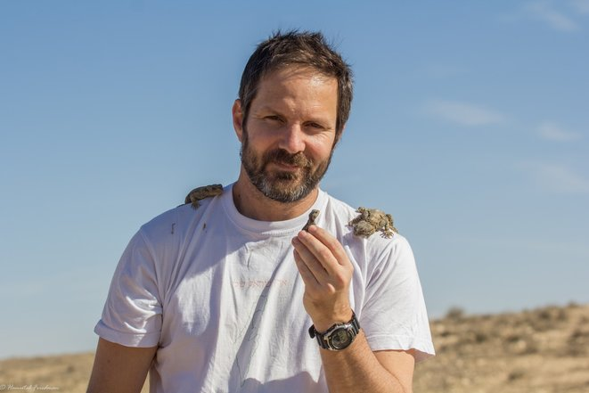<br>

Shai Meiri

<br>

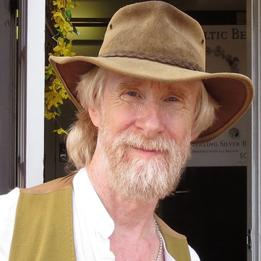<br>

Mark O'Shea

</p>

</center>

]

.pull-right[

<center>

<br>

Gustavo Burin

<br>

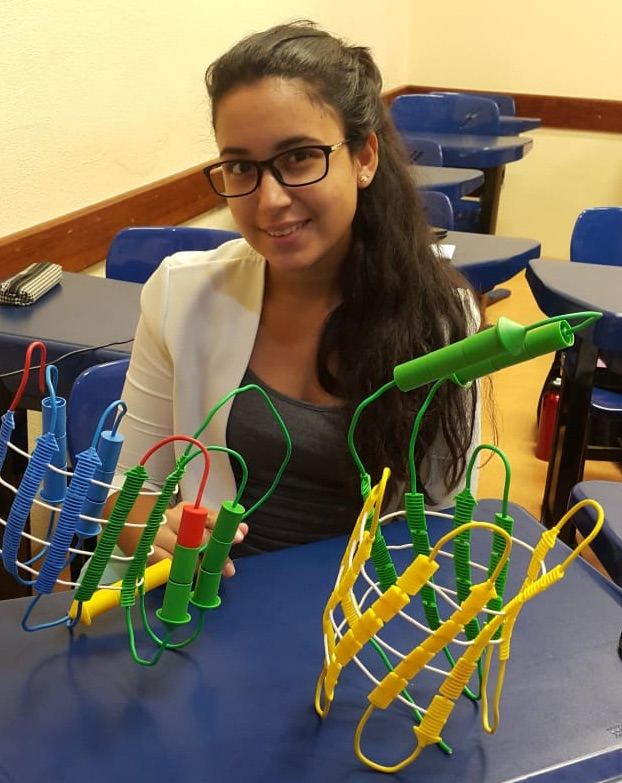<br>

Camila Tabares

</center>

]

---

# The foraging-mode paradigm


.pull-left[

<p align="center">

<span style="color: red;" > Active foragers </span>

</p>


<center>


</center>

]

.pull-right[

<p align="center">

<span style="color: red;" > Sit-and-wait foragers </span>

</p>


<center>


</center>

]

---

# Hypotheses about how an organism’s foraging mode relates to its life history


```{r, echo = FALSE, fig.height = 7, fig.width = 7, fig.align = "center", warning = FALSE, comment = " ", message = FALSE}


require(shape)

par(mar = c(1, 1, 1, 1))
plot(NA, NA, xlim = c(0, 10), ylim = c(-1, 10), ann = FALSE, axes = FALSE)


text(5, 10, "Foraging mode")
segments(3.5, 9.6, 6.5, 9.6, lwd = 2)
segments(3.5, 10.4, 6.5, 10.4, lwd = 2)
segments(3.5, 10.4, 3.5, 9.6, lwd = 2)
segments(6.5, 10.4, 6.5, 9.6, lwd = 2)
text(5, 7, "Distance traveled")
segments(3.5, 6.5, 6.5, 6.5, lwd = 2)
segments(3.5, 7.5, 6.5, 7.5, lwd = 2)
segments(3.5, 6.5, 3.5, 7.5, lwd = 2)
segments(6.5, 7.5, 6.5, 6.5, lwd = 2)
text(8.6, 7, "Predation risk")
segments(7.5, 6.5, 9.8, 6.5, lwd = 2)
segments(7.5, 7.5, 9.8, 7.5, lwd = 2)
segments(7.5, 6.5, 7.5, 7.5, lwd = 2)
segments(9.8, 7.5, 9.8, 6.5, lwd = 2)

Arrows(5, 9.5, 5, 7.8, lwd = 2, arr.type = "triangle")
Arrows(6.6, 7, 7, 7, lwd = 2, arr.type = "triangle")

```

---

# Hypotheses about how an organism’s foraging mode relates to its life history

```{r, echo = FALSE, fig.height = 7, fig.width = 7, fig.align = "center", warning = FALSE, comment = " ", message = FALSE}

par(mar = c(1, 1, 1, 1))
plot(NA, NA, xlim = c(0, 10), ylim = c(-1, 10), ann = FALSE, axes = FALSE)


text(5, 10, "Foraging mode")
segments(3.5, 9.6, 6.5, 9.6, lwd = 2)
segments(3.5, 10.4, 6.5, 10.4, lwd = 2)
segments(3.5, 10.4, 3.5, 9.6, lwd = 2)
segments(6.5, 10.4, 6.5, 9.6, lwd = 2)
text(5, 7, "Distance traveled")
segments(3.5, 6.5, 6.5, 6.5, lwd = 2)
segments(3.5, 7.5, 6.5, 7.5, lwd = 2)
segments(3.5, 6.5, 3.5, 7.5, lwd = 2)
segments(6.5, 7.5, 6.5, 6.5, lwd = 2)
text(8.6, 7, "Predation risk")
segments(7.5, 6.5, 9.8, 6.5, lwd = 2)
segments(7.5, 7.5, 9.8, 7.5, lwd = 2)
segments(7.5, 6.5, 7.5, 7.5, lwd = 2)
segments(9.8, 7.5, 9.8, 6.5, lwd = 2)
text(8.64, 3.7, "Reproductive effort")
segments(7.2, 4.2, 10.1, 4.2, lwd = 2)
segments(7.2, 3.2, 10.1, 3.2, lwd = 2)
segments(7.2, 4.2, 7.2, 3.2, lwd = 2)
segments(10.1, 3.2, 10.1, 4.2, lwd = 2)

Arrows(5, 9.5, 5, 7.8, lwd = 2, arr.type = "triangle")
Arrows(6.6, 7, 7, 7, lwd = 2, arr.type = "triangle")
Arrows(8.7, 4.8, 8.7, 6.1, lwd = 2, arr.type = "triangle")
Arrows(8.7, 6.1, 8.7, 4.8, lwd = 2, arr.type = "triangle")
Arrows(8.3, 4.76, 6.3, 6.2, lwd = 2, arr.type = "triangle")


```


---


# Hypotheses about how an organism’s foraging mode relates to its life history

```{r, echo = FALSE, fig.height = 7, fig.width = 7, fig.align = "center", warning = FALSE, comment = " ", message = FALSE}


par(mar = c(1, 1, 1, 1))
plot(NA, NA, xlim = c(0, 10), ylim = c(-1, 10), ann = FALSE, axes = FALSE)


text(5, 10, "Foraging mode")
segments(3.5, 9.6, 6.5, 9.6, lwd = 2)
segments(3.5, 10.4, 6.5, 10.4, lwd = 2)
segments(3.5, 10.4, 3.5, 9.6, lwd = 2)
segments(6.5, 10.4, 6.5, 9.6, lwd = 2)
text(5, 7, "Distance traveled")
segments(3.5, 6.5, 6.5, 6.5, lwd = 2)
segments(3.5, 7.5, 6.5, 7.5, lwd = 2)
segments(3.5, 6.5, 3.5, 7.5, lwd = 2)
segments(6.5, 7.5, 6.5, 6.5, lwd = 2)
text(8.6, 7, "Predation risk")
segments(7.5, 6.5, 9.8, 6.5, lwd = 2)
segments(7.5, 7.5, 9.8, 7.5, lwd = 2)
segments(7.5, 6.5, 7.5, 7.5, lwd = 2)
segments(9.8, 7.5, 9.8, 6.5, lwd = 2)
text(8.64, 3.7, "Reproductive effort")
segments(7.2, 4.2, 10.1, 4.2, lwd = 2)
segments(7.2, 3.2, 10.1, 3.2, lwd = 2)
segments(7.2, 4.2, 7.2, 3.2, lwd = 2)
segments(10.1, 3.2, 10.1, 4.2, lwd = 2)
text(4.97, 3.7, "Energy gain")
segments(3.7, 4.2, 6.2, 4.2, lwd = 2)
segments(3.7, 3.2, 6.2, 3.2, lwd = 2)
segments(3.7, 4.2, 3.7, 3.2, lwd = 2)
segments(6.2, 4.2, 6.2, 3.2, lwd = 2)


Arrows(5, 9.5, 5, 7.8, lwd = 2, arr.type = "triangle")
Arrows(6.6, 7, 7, 7, lwd = 2, arr.type = "triangle")
Arrows(8.7, 4.8, 8.7, 6.1, lwd = 2, arr.type = "triangle")
Arrows(8.7, 6.1, 8.7, 4.8, lwd = 2, arr.type = "triangle")
Arrows(8.3, 4.76, 6.3, 6.2, lwd = 2, arr.type = "triangle")
Arrows(5, 4.8, 5, 6.1, lwd = 2, arr.type = "triangle")
Arrows(5, 9.5, 5, 7.8, lwd = 2, arr.type = "triangle")
Arrows(5, 6.3, 5, 4.8, lwd = 2, arr.type = "triangle")

```

---


# Hypotheses about how an organism’s foraging mode relates to its life history


```{r, echo = FALSE, fig.height = 7, fig.width = 7, fig.align = "center", warning = FALSE, comment = " ", message = FALSE}

par(mar = c(1, 1, 1, 1))
plot(NA, NA, xlim = c(0, 10), ylim = c(-1, 10), ann = FALSE, axes = FALSE)


text(5, 10, "Foraging mode")
segments(3.5, 9.6, 6.5, 9.6, lwd = 2)
segments(3.5, 10.4, 6.5, 10.4, lwd = 2)
segments(3.5, 10.4, 3.5, 9.6, lwd = 2)
segments(6.5, 10.4, 6.5, 9.6, lwd = 2)
text(5, 7, "Distance traveled")
segments(3.5, 6.5, 6.5, 6.5, lwd = 2)
segments(3.5, 7.5, 6.5, 7.5, lwd = 2)
segments(3.5, 6.5, 3.5, 7.5, lwd = 2)
segments(6.5, 7.5, 6.5, 6.5, lwd = 2)
text(4.97, 3.7, "Energy gain")
segments(3.7, 4.2, 6.2, 4.2, lwd = 2)
segments(3.7, 3.2, 6.2, 3.2, lwd = 2)
segments(3.7, 4.2, 3.7, 3.2, lwd = 2)
segments(6.2, 4.2, 6.2, 3.2, lwd = 2)
text(8.6, 7, "Predation risk")
segments(7.5, 6.5, 9.8, 6.5, lwd = 2)
segments(7.5, 7.5, 9.8, 7.5, lwd = 2)
segments(7.5, 6.5, 7.5, 7.5, lwd = 2)
segments(9.8, 7.5, 9.8, 6.5, lwd = 2)

text(8.64, 3.7, "Reproductive effort")
segments(7.2, 4.2, 10.1, 4.2, lwd = 2)
segments(7.2, 3.2, 10.1, 3.2, lwd = 2)
segments(7.2, 4.2, 7.2, 3.2, lwd = 2)
segments(10.1, 3.2, 10.1, 4.2, lwd = 2)

text(1.57, 3.7, "Energy expenditure")
segments(0, 4.2, 3.1, 4.2, lwd = 2)
segments(0, 3.2, 3.1, 3.2, lwd = 2)
segments(0, 4.2, 0, 3.2, lwd = 2)
segments(3.1, 4.2, 3.1, 3.2, lwd = 2)

Arrows(5, 9.5, 5, 7.8, lwd = 2, arr.type = "triangle")
Arrows(5, 6.3, 5, 4.8, lwd = 2, arr.type = "triangle")
Arrows(5, 4.8, 5, 6.1, lwd = 2, arr.type = "triangle")
Arrows(3.8, 6.3, 2, 4.8, lwd = 2, arr.type = "triangle")
Arrows(8.3, 4.76, 6.3, 6.2, lwd = 2, arr.type = "triangle")
Arrows(8.7, 6.1, 8.7, 4.8, lwd = 2, arr.type = "triangle")
Arrows(8.7, 4.8, 8.7, 6.1, lwd = 2, arr.type = "triangle")
Arrows(6.6, 7, 7, 7, lwd = 2, arr.type = "triangle")
Arrows(7.1, 3.7, 6.5, 3.7, lwd = 2, arr.type = "triangle")
Arrows(6.5, 3.7, 7.0, 3.7, lwd = 2, arr.type = "triangle")

```


---

# Functional reproductive volume


<center> 


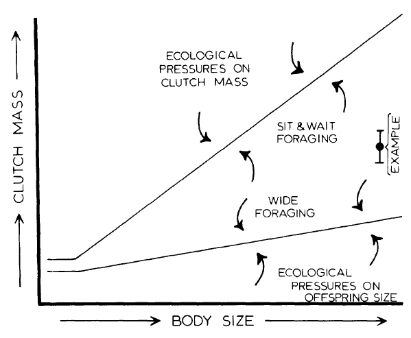


<p align = "center">

<span style = "color: red;" > Strategy 1: Sit-and-wait foragers; </span>

<span style = "color: red;" > Strategy 2: active foragers </span>

</p>

<br>

<center>

Vitt and Congdon (1978)

</center>

---

# Sit-and-wait lizards evolved greater reproductive effort than did active-foraging lizards


<center>

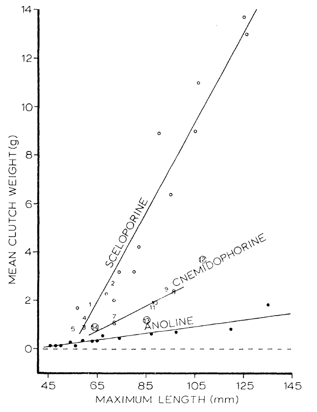

</center>

<br>

<center>

Vitt and Congdon (1978)

</center>


---

<center>


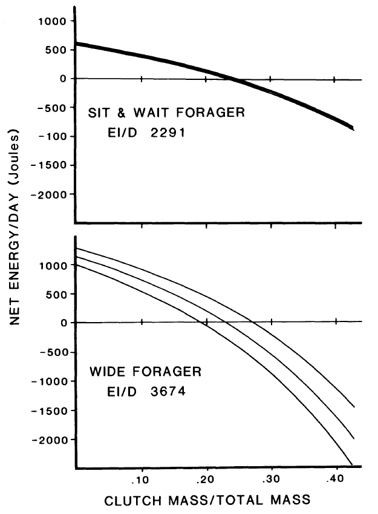


</center>

<br>

<center>

Vitt and Price (1982)

</center>

---


# The long-standing prediction of a relationship between foraging mode and life-history traits is currently unsupported


.pull-left[


<center>

<br><br><br><br><br>

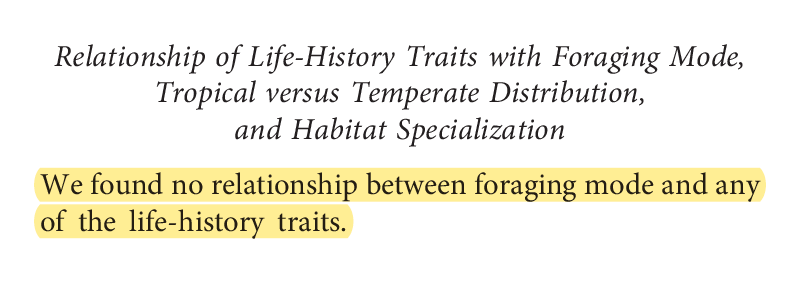

</center>

]

.pull-right[

<br><br>

<center>


</center>

]

<br><br><br><br>

<center>

Mesquita et al. (2016)

</center>


---

# Data source and description of variables

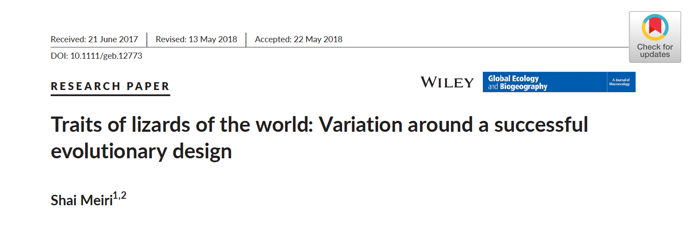


- Hatchling mass
- Offspring number
- Female mass
- Scaled-mass index

<br><br>

<center>

\[Reproductive\; output=Hatchling\; size \times Offspring\; number \]

</center>


---

# Ancestral reconstruction of foraging mode

<br>

- We used a set of continuous-time, discrete-state Markov chain models to sample the character histories from their posterior probability distribution

--

- We fitted three different models to our data, using the function `make.simmap` from the [`phytools` `r emo::ji("package")`](https://cran.r-project.org/web/packages/phytools/index.html) of `r icons::fontawesome("r-project")`, v. 1.0.1

--

- We estimated the prior distribution on the root node of the tree (`pi = 'estimated'`) and sampled the transition matrix, `Q`, from its posterior distribution (`Q = 'mcmc'`).

--

- We selected the most likely model of evolution based on the Akaike information criterion (AIC)

---

# Effects of maternal mass and foraging mode on reproductive output

- We used PGLS to model the relationship among maternal mass, foraging mode and reproductive output through the `gls` function from the [`nlme` `r emo::ji("package")`](https://cran.r-project.org/web/packages/nlme/index.html) of `r icons::fontawesome("r-project")`, v. 3.1.153

--

- The slope of the linear relationship can be interpreted as reproductive effort—proportion of mass allocated to reproduction—which enabled us to avoid statistical issues associated with the analysis of ratios

--

- Models in which maternal mass was standardized (M) enabled us to deal with outliers, thus increasing the robustness of our conclusions


---

# Sit-and-wait foraging is the most likely ancestral state


<center>


</center>


---

# Foraging mode is conserved among lizards


<center>


</center>


---

# The evolution of reproductive effort in lizards was driven by an interaction between maternal mass and foraging mode


<center>

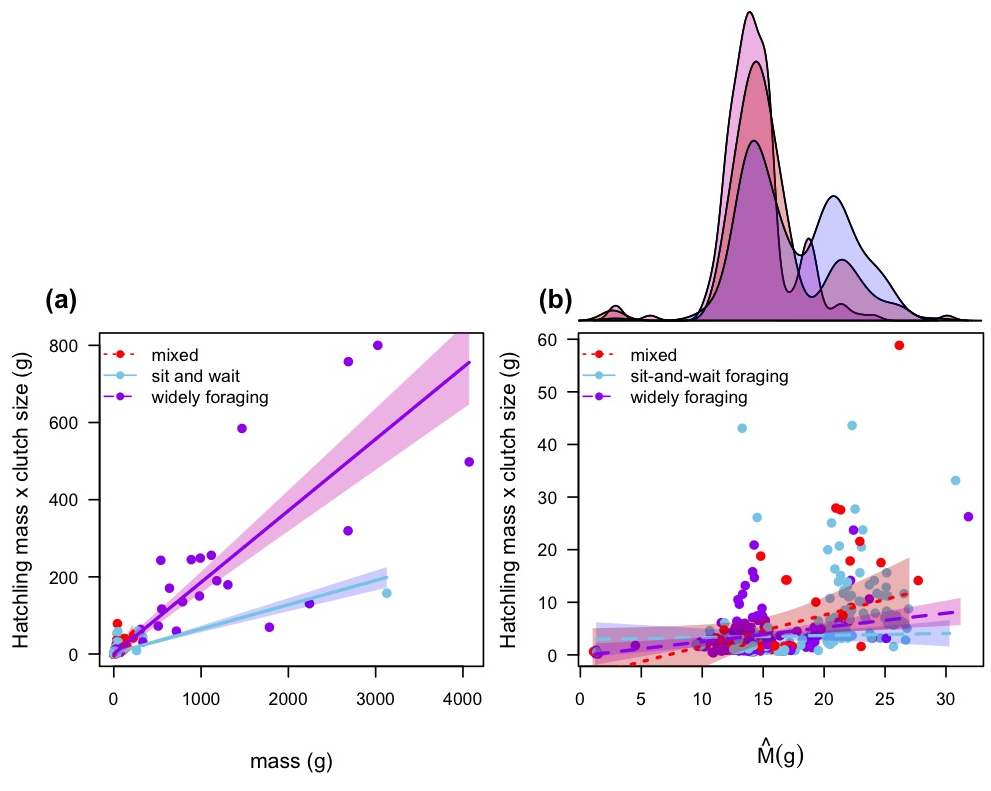

</center>

---


Our analysis provides evidence that  widely-foraging lizards have evolved greater reproductive effort, but only in heavier species. Food consumption may play an important role:

<br>

.pull-left[

<center>

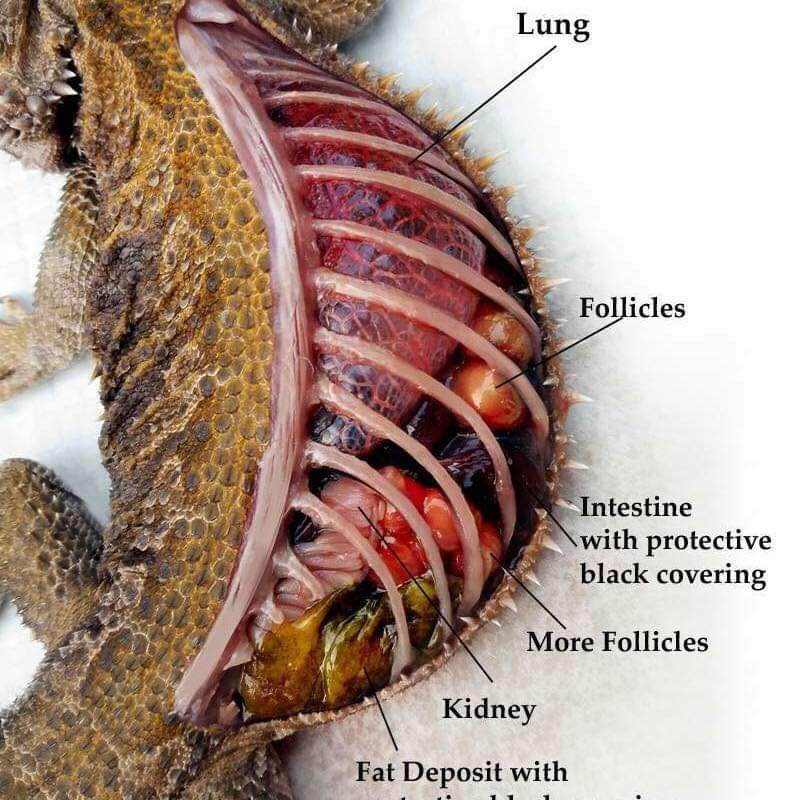

Promoting follicular growth

]

.pull-right[

<center>

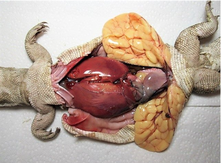

Increasing energy stores to initiate reproduction

</center>

]


---

Our analysis provides evidence that  widely-foraging lizards have evolved greater reproductive effort, but only in heavier species. Food consumption may play an important role:

<br>

<center>


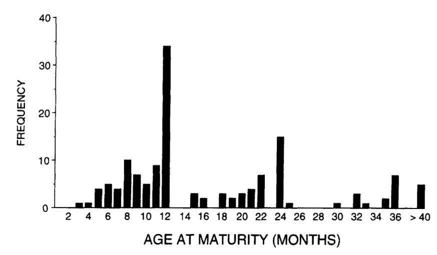<br>

Reducing age at first reproduction

</center>

---


```{r, fig.height = 3.5, fig.width = 3.5, comment = " ", message = FALSE}


## A


bertalanffy <- function(la, k, t){

    la <- as.numeric(la)
    k <- as.numeric(k)
    t <- as.numeric(t)
    la*(1 - 4*exp(-k*t))

}

fem1 <- bertalanffy(la = 4, k = 0.3, t = seq(1, 35, 1))
fem2 <- bertalanffy(la = 4.9, k = 0.25, t = seq(1, 35, 1))

par(mar = c(5, 4, 1, 1), mgp = c(1, 1, 1))
plot(fem1 - 0.7 ~ seq(1, 35, 1), xlim = c(-2, 35), ylim = c(-6, 8), type = "l", lwd = 2, xaxt = "n", yaxt = "n", ylab = "Cumulative energy gain (m)", xlab = "time (t)")
lines(seq(1, 35, 1) - 0.48, fem2, lwd = 2, lty = 4)
legend("topleft", legend = c("large female", "small female"), lty = c(4, 1), lwd = c(2, 2), bty = "n", cex = 0.7)


```


---


```{r, fig.height = 3.5, fig.width = 3.5, comment = " ", message = FALSE}


## B

fem3 <- bertalanffy(la = 5, k = 0.082, t = seq(1, 35, 1))
fem4 <- bertalanffy(la = 10, k = 0.21, t = seq(1, 35, 1))

par(mar = c(5, 4, 1, 1), mgp = c(1, 1, 1))
plot(fem3 - 0.7 ~ seq(1, 35, 1), xlim = c(4, 35), ylim = c(-6, 5), type = "l", lwd = 2,  col = "skyblue", xaxt = "n", yaxt = "n", ylab = "Cumulative energy gain (m)", xlab = " ")
lines(seq(1, 35, 1), fem4 - 8, lwd = 2, lty = 2, col = "purple")
legend("topleft", legend = c("sit and wait", "widely foraging"), lty = c(1, 2), lwd = c(2, 2), col = c("skyblue", "purple"), bty = "n", cex = 0.7)
mtext("time (t)", side = 1, at = 25, line = 0.9, cex = 0.8)

```


---


```{r, fig.height = 3.5, fig.width = 3.5, comment = " ", message = FALSE}


## B

fem3 <- bertalanffy(la = 5, k = 0.082, t = seq(1, 35, 1))
fem4 <- bertalanffy(la = 10, k = 0.21, t = seq(1, 35, 1))

par(mar = c(5, 4, 1, 1), mgp = c(1, 1, 1))
plot(fem3 - 0.7 ~ seq(1, 35, 1), xlim = c(4, 35), ylim = c(-6, 5), type = "l", lwd = 2,  col = "skyblue", xaxt = "n", yaxt = "n", ylab = "Cumulative energy gain (m)", xlab = " ")
lines(seq(1, 35, 1), fem4 - 8, lwd = 2, lty = 2, col = "purple")
segments(2.6, -6.5, 25, 6.2, lwd = 2)
segments(2.6, -6.5, 33.2, 6, lwd = 2)
legend("topleft", legend = c("sit and wait", "widely foraging"), lty = c(1, 2), lwd = c(2, 2), col = c("skyblue", "purple"), bty = "n", cex = 0.7)
mtext("time (t)", side = 1, at = 25, line = 0.9, cex = 0.8)


```


---


```{r, fig.height = 3.5, fig.width = 3.5, comment = " ", message = FALSE}


## B

fem3 <- bertalanffy(la = 5, k = 0.082, t = seq(1, 35, 1))
fem4 <- bertalanffy(la = 10, k = 0.21, t = seq(1, 35, 1))

par(mar = c(5, 4, 1, 1), mgp = c(1, 1, 1))
plot(fem3 - 0.7 ~ seq(1, 35, 1), xlim = c(4, 35), ylim = c(-6, 5), type = "l", lwd = 2,  col = "skyblue", xaxt = "n", yaxt = "n", ylab = "Cumulative energy gain (m)", xlab = " ")
lines(seq(1, 35, 1), fem4 - 8, lwd = 2, lty = 2, col = "purple")
segments(2.6, -6.5, 25, 6.2, lwd = 2)
segments(2.6, -6.5, 33.2, 6, lwd = 2)
segments(13.2, -0.5, 2.6, -0.5, lwd = 2, lty = 2, col = "purple")
segments(15.9, -1.1, 2.6, -1.1, lwd = 2, col = "skyblue")
segments(13.2, -0.5, 13.2, -7, lwd = 2, lty = 2, col = "purple")
segments(15.9, -1.1, 15.9, -7, lwd = 2, col = "skyblue")
legend("topleft", legend = c("sit and wait", "widely foraging"), lty = c(1, 2), lwd = c(2, 2), col = c("skyblue", "purple"), bty = "n", cex = 0.7)
mtext("(b)", at = 0.6, line = 1, cex = 0.8, font = 2)
mtext(expression("t"[wf]), side = 1, at = 13.2, line = 0.5, cex = 0.8, font = 2)
mtext(expression("t"[sw]), side = 1, at = 17.2, line = 0.5, cex = 0.8, font = 2)
mtext("time (t)", side = 1, at = 25, line = 0.9, cex = 0.8)

```


---


```{r, fig.height = 3.5, fig.width = 3.5, comment = " ", message = FALSE}

## C

par(mar = c(5, 4, 1, 1), mgp = c(1, 1, 1))
curve(2 - log(x)^2, ylim = c(-0.5, 3), xlim = c(0.1, 1), lwd = 2, lty = 2, col = "purple", xaxt = "n", yaxt = "n", ylab = "Cumulative energy gain (m)", xlab = "time (t)")
curve(log(x) + 1, add = TRUE, lwd = 2, col = "skyblue")
legend("topleft", legend = c("sit and wait", "widely foraging"), lty = c(1, 2), lwd = c(2, 2), col = c("skyblue", "purple"), bty = "n", cex = 0.7)
mtext("(c)", at = 0.001, line = 1, cex = 0.8, font = 2)


```


---

# Concluding remarks

<br>

- The early shift in foraging mode—from sit-and-wait foraging to widely foraging—in the evolutionary history of lacertilians was likely accompanied by the evolution of a greater reproductive effort, specifically in large-bodied species of lizards

<br>

- Importantly, our study captured the effects of foraging plasticity on the reproductive effort of lizards. For instance, lizards that adopt a mixed-foraging strategy produced the greatest reproductive effort


.pull-left[

<center>

<br><br>

To find more, see `r emo::ji("index")`

</center>

]

.pull-right[


]
